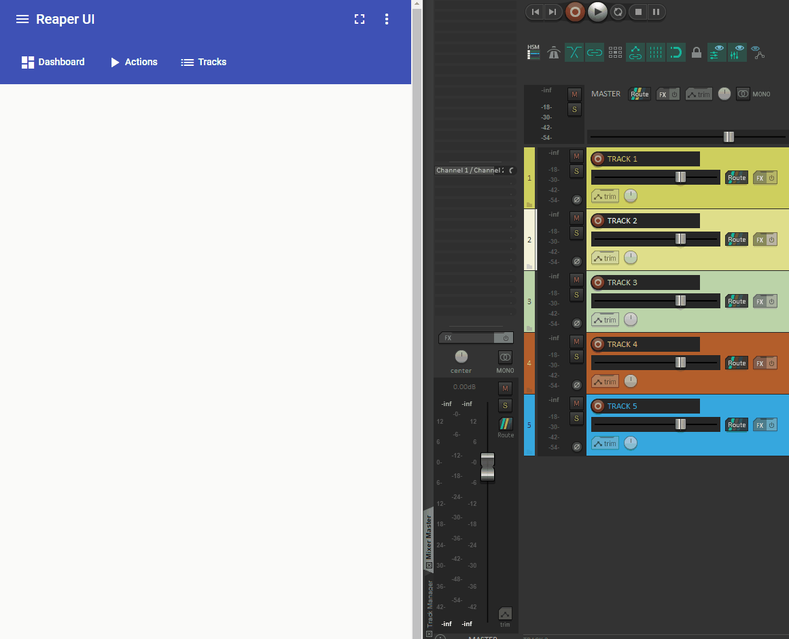

# Reaper UI
An Angular Material based web-UI client for the REAPER DAW.

# Installation
1. Go to [releases section](https://github.com/BuriedStPatrick/reaper-ui/releases/) and get the latest version
2. Download the zip-file and extract it into the REAPER web pages folder `C:\PATH\TO\REAPER\INSTALLATION\reaper_www_root`. Do not replace index.html if it asks you. You might be overriding another one of your web interfaces.
3. Rename the `index.html` file from the extracted files to something like `reaper-ui.html`
4. The page should now show up as whatever you renamed the `index.html`-file as within REAPER Preferences => Control/OSC/Web => Web browser interface.

# Building
1. See readme in `reaper-webapp` for building the webapp
2. Compile the app.
3. Go to the compiled app and rename the index.html-file to something unique like reaper-ui.html.
4. Then take the entire app with the renamed index.html-file and place it into the REAPER web user pages folder (`C:\PATH\TO\REAPER\INSTALLATION\reaper_www_root`)
5. It should now have an option to select within REAPER Preferences => Control/OSC/Web => Web browser interface

# Development
1. Clone the repo.
2. Go to `.\reaper-webapp` and run `yarn` to install all dependencies.
3. Open REAPER DAW and set up a random web interface. (It doesn't matter which, we simply need the API to be running)
4. Open `proxy.config.json` and set `target` equal to whatever your web interface is pointing to. This will allow us to proxy our app's API-calls to REAPER. In my experience, setting `localhost:1234` for the target doesn't seem to work for whatever reason, only the actual local IP.
5. Run `yarn start` in `.\reaper-webapp` to serve the app at `localhost:4200`.
