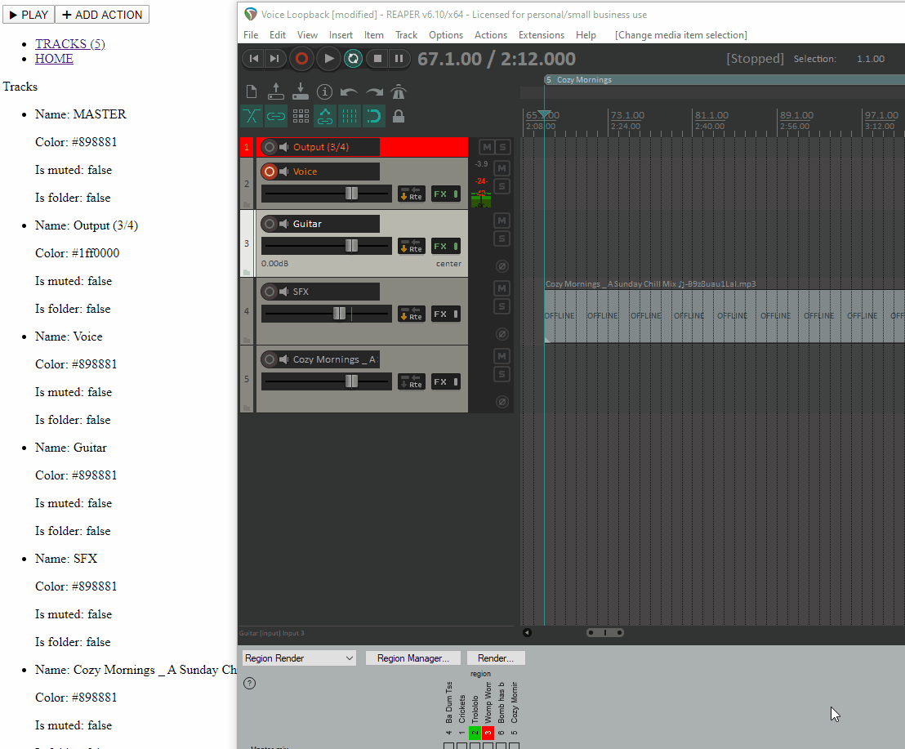

# Reaper UI
An Angular based web-UI component library and client for the REAPER DAW.

# Building
1. See readme in `reaper-webapp` for building the webapp
2. Compile the app.
3. Go to the compiled app and rename the index.html-file to something unique like reaper-ui.html.
4. Then take the entire app with the renamed index.html-file and place it into the REAPER web user pages folder (`C:\PATH\TO\REAPER\INSTALLATION\reaper_www_root`)
5. It should now have an option to select within REAPER Preferences => Control/OSC/Web => Web browser interface
